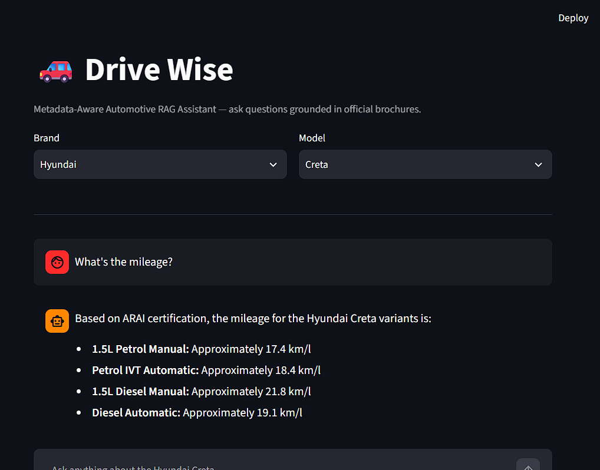
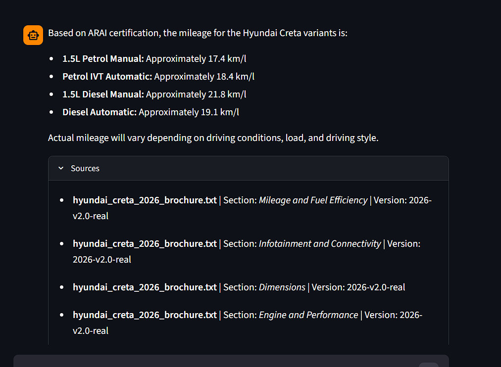

# DriveWise-RAG

## Overview
DriveWise is a Retrieval-Augmented Generation (RAG) system that answers automotive brochure questions using official manufacturer brochure data.

## Features
- Metadata Filtering
- FAISS Semantic Search
- BM25 Lexical Search
- Hybrid Re-ranking
- Gemini LLM
- Query Caching
- Source Attribution
- Evaluation Harness

## Architecture
User Query
↓
Metadata Filter
↓
FAISS + BM25 Retrieval
↓
Hybrid Re-ranking
↓
Gemini
↓
Answer + Sources

## Evaluation Results
Context Relevance: 1.00
Faithfulness: 1.00
Answer Correctness: 1.00
## Screenshots

### Home Page

### Question Answering Demo

## Tech Stack
Python, LangChain, Gemini, FAISS, BM25, Streamlit

## Run Locally
pip install -r requirements.txt
python vectorstore.py --build
streamlit run streamlit_app.py
